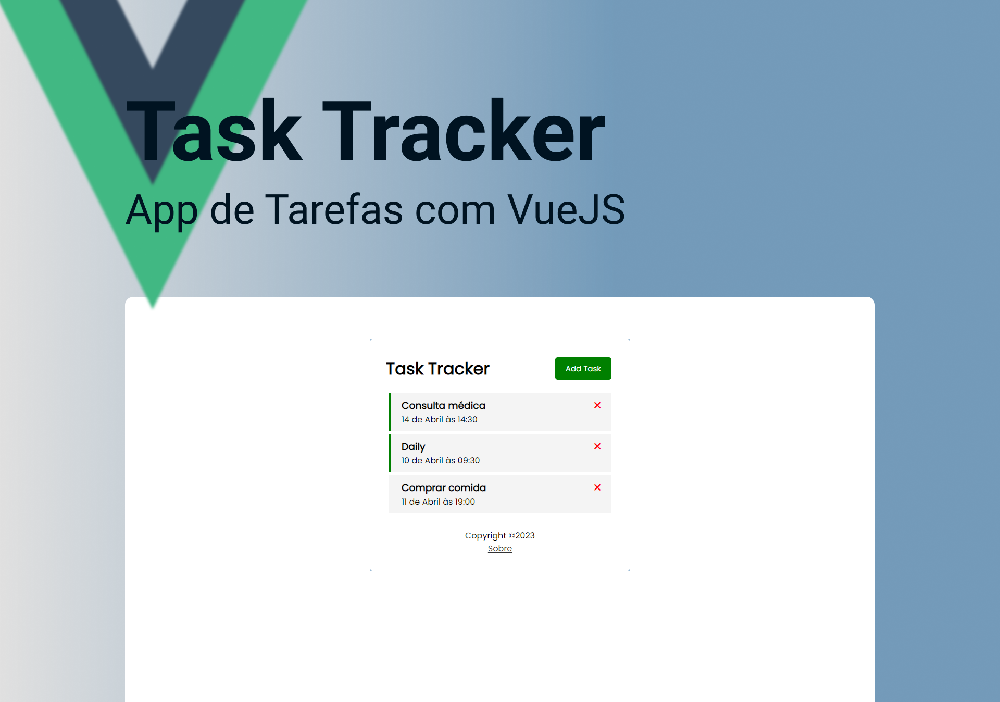

<div align="center">
<h1> Task Tracker </h1>
</div>

<p align="center">
Aplicarivo de tarefas criado para iniciar os estudos com VueJS.. <br/>
Foi seguido o courso do <a href="https://www.youtube.com/@TraversyMedia">Traversy Media</a> no YouTube. <br/>
<a href="https://www.youtube.com/watch?v=qZXt1Aom3Cs&ab_channel=TraversyMedia">Assista ao vídeo clicando aqui.</a>
</p>

<p align="center">
  <a href="#-tecnologias">Tecnologias</a>&nbsp;&nbsp;&nbsp;|&nbsp;&nbsp;&nbsp;
  <a href="#-projeto">Projeto</a>&nbsp;&nbsp;&nbsp;|&nbsp;&nbsp;&nbsp;
  <a href="#-layout">Layout</a>&nbsp;&nbsp;&nbsp;|&nbsp;&nbsp;&nbsp;
  <a href="#-instalação">Instalação</a>&nbsp;&nbsp;&nbsp;|&nbsp;&nbsp;&nbsp;
  <a href="#memo-licença">Licença</a>&nbsp;&nbsp;&nbsp;|&nbsp;&nbsp;&nbsp;
</p>

<p align="center">
  
</p>

<br>

<p align="center">
  
</p>

## 🚀 Tecnologias

Esse projeto foi desenvolvido com as seguintes tecnologias:

- Javascript
- VueJS
- Vite
- Vite Router
- Figma
- Vercel

## 💻 Projeto

O Task Tracker foi desenvolvido como um estudo inicial do framework VUeJS. <br />
O objetivo do app é ser um aplicativo de tarefas simples, clicando em Add Task é aberto um formulário com dois campos que recebem a Task que deve ser feta em conjunto com a Data em forma de string, e contém um chekbox para um reminder o qual adicionará uma borda verde ao lado da Task. <br />
Clicando duas vezes sobre uma task o reminder é adicionado ou removido, e clicando no X no canto superior direito da task a mesma é excluída, porém,  antes é exibido um aviso confirmando a ação.
Esse é meu primeiro projeto com VueJS.

- [Acesse o deploy do projeto, na Vercel](https://florenciomath-tasktracker.vercel.app/)

## 🔖 Layout

O layout desse projeto foi feito seguindo o curso no YouTube e não foi fornecido um arquivo no Figma. 


## 🪛 Instalação 

### Pré-requisitos

* npm
```sh
 npm install npm@latest -g
````

### Instalação

1. Clone o repositório
```sh
https://github.com/florencioMath/Course-TaskTracker.git
```
2. Entre na pasta e instale as dependências
```sh
$ cd task-tracker
$ npm install
```
3. Inicie o projeto
```sh
$ npm run dev
```
4. Abra no navegador 
```txt
http://localhost:5173/
```

## :memo: Licença

Esse projeto está sob a licença MIT.

---

Feito com 🖤 by Matheus Florêncio :wave:
